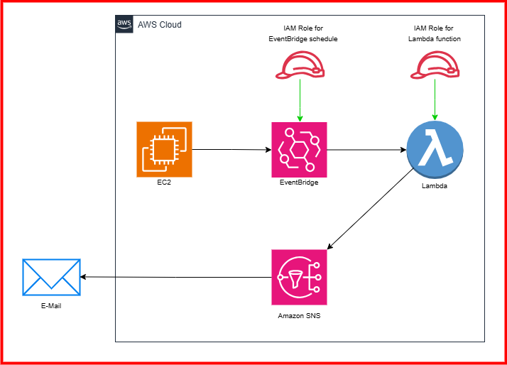

# Notify Subscribers about missing EC2 tags
## 📌Project Overview
The purpose of this project is to ensure that all EC2 instances in your AWS environment have the necessary tags, specifically the `Environment` tag. Proper tagging of resources is crucial for effective cost management, resource organization, and compliance. This solution automatically checks all running EC2 instances and sends an email notification to subscribed users if any instance is missing the required tag.
### Why is tagging important?
* **Cost Allocation**: Helps in identifying and managing costs associated with specific projects or environments.
* **Resource Organization**: Makes it easier to filter and manage resources in a large-scale environment.
* **Automation and Compliance**: Ensures that instances adhere to tagging policies, enabling automation and compliance checks.
## Architecture

### **Services used:**
1. **Amazon EC2** - Compute service where instances are monitored for missing tags.
2. **Amazon EventBridge(CW Events)** - Triggers the Lambda function on a schedule to check for missing tags.
3. **AWS Lambda** - Executes a Python script to verify the presence of the `Environment` tag on EC2 instances.
4. **Amazon SNS (Simple Notification Service)** - Sends email notifications to subscribers about missing tags.
5. **Email Subscription** - Receives alerts from SNS notifications.
## Steps in building the project
### **Step 1 - Create an SNS Topic for Email Notifications**
* Go to AWS console->SNS->Topics->Click on `Create Topic`.
* Select the Type of Topic as `Standard`. Enter the name of the Topic as `MissingTagNotifications`. Leave everything as
  default and click on `Create Topic`.
* Create a *Subscription* for the Topic. Go to **Subscriptions**->**Create Subscription**->Enter the ARN of the Topic that
  you created.
* Enter the protocol as `Email`. Enter your E-Mail address under **Endpoint**. Then click on **Create Subscription**.
* Now, logIn to your E-Mail account and **confirm** your E-Mail to be used as a subscription.
### **Step 2 - Create an IAM Role for the Lambda function**
* Go to AWS Console-> Roles-> Create Role-> Attach `AdministratorAccess` permission policy. If you are in production
  environment restrict the permissions to only whatever is needed. You should attach `AmazonCloudWatchFullAccess`,
  `AmazonEventBridgeFullAccess`, `AmazonSNSFullAccess` and `EC2DescribeInstances` to read instance tags.
### **Step 3 - Create a Lambda function to check the EC2 Instances**
* Go to AWS console-> Lambda-> Create function-> Enter the function name as `CheckEC2Tags`. Select the latest Python Runtime.
* Under **Change default execution role** choose the IAM role that you created. Then Click on `Create function`.
* Write and **Deploy** a simple python code for Lambda function.
* Go to **Configuration**, Select **Environment Variables** add **Key** as `SNS_TOPIC_ARN` and Under **Value** enter the ARN
  of your SNS Topic.
### Step 4 - Create a CloudWatch Rule(EventBridge)
* Go to EventBridge-> Rules-> Create Rules-> Name it as `CheckEC2Tags`. Select the Rule Type as `Schedule`. Then Click on
  `Continue in EventBridge Scheduler`. This will take take us to the EventBridge console.
* Under **Schedule Pattern**, select the Occurrence as `Recurring Schedule`. Select the **Time Zone** you are in. Select
  `Cron-based schedule` type. Enter the below CRON expression to trigger the notification every 5 minutes.
  ```
  cron(0/5 * * * ? *)
  ```
* Select the **Flexible time window** as `5 minutes`. Enter the **Start** and **End** date and time. Click on `Next`.
* You need to select the **Target API**. Select `AWS Lambda Invoke`and Select the Lambda function that you have created.
* Under **Action after schedule completion** choose `NONE`.
* Under **Permissions** select `Create new role for this schedule`. This role is required for EventBridge to check EC2
  instances or trigger Lambda functions based on EC2 state changes (like instance start/stop or tags updates), it requires
  EC2 read access and a permission to invoke Lambda function.
* At last click on `Create Schedule`.
### 🔎 Testing
* Go to EC2 Console-> Launch two instances.
* Select an EC2 instance, under **Tag** add a Tag. Enter the key as `Environment`. Enter the Value as `Prod`.
* Leave the other instance as it is without adding a tag.
* Once the schedule triggers the lambda function you will receive an E-Mail. You should receive an E-Mail like "**These EC2
  instances are missing the 'Environment tag':{instance-ID}**"
## 🔄 Conclusion
This project helps enforce consistent tagging of EC2 instances in your AWS environment, improving resource management and cost tracking. By leveraging AWS services like EventBridge, Lambda, SNS, and EC2, this solution provides a scalable, automated way to monitor EC2 instances and notify subscribers when tags are missing.
