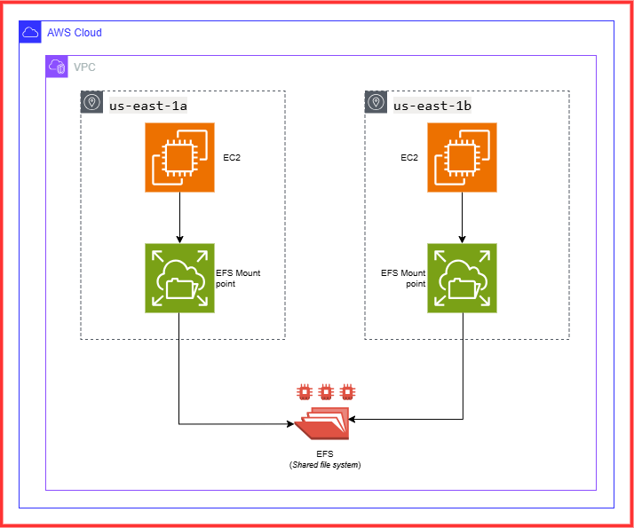

# Building a Scalable Storage Solution with AWS EFS and EC2
## 📘Project Overview
In this project, we design and implement a Scalable Storage Solution using AWS Elastic File System (EFS) and EC2 instances. The project demonstrates a solution that requires a centralized, scalable, and highly available storage solution for managing large volumes of files. By leveraging EFS, we can achieve a fully managed, elastic, and high-performance shared file system that can be accessed by multiple EC2 instances deployed across different Availability Zones (AZs).
 EFS offers a fully managed, elastic, and highly available shared file system, which multiple EC2 instances can access simultaneously. This allows different teams to collaborate seamlessly and work on shared assets without storage bottlenecks.
## Architecture diagram

### Key components:
   * **EC2 instances**: EC2 instances serve as the clients that access and utilize the shared storage provided by Amazon EFS. EC2 
     instances are deployed in multiple Availability Zones (AZs) to access the shared file system (EFS) concurrently. This setup
     allows production teams to work on the same set of media files from different servers without needing to copy or transfer
     files between instances.
     The EC2 instances use NFS to mount the EFS file system. The secure data transfer between EC2 and EFS is encrypted in 
     transit using TLS, ensuring that sensitive files are protected.
   * **VPC with Subnets**: The infrastructure is set up within a Virtual Private Cloud (VPC) with subnets in different AZs.
   * **Security Groups**: Control inbound and outbound traffic for the EC2 instances and EFS mount targets.
   * **Amazon Elastic File System (EFS)**: Provides scalable, high-performance, and highly available shared storage for
     multiple EC2 instances.

## Project Set-Up:
### Step 1 - Launching EC2 instances in Multiple Availabilty Zones
* Launch two EC2 instances in different AZs to ensure high availability, performance and redundancy. Both instances will
  share access to the same AWS EFS.
* **Create a Security group**: We need to create a SG to keep things safe. This SG will be associated with both EFS mount
  targets and the EC2 instances that need to access the EFS file system.
  ```
  aws ec2 create-security-group --group-name StorageLabs --description "SG for EFS storage"
  ```
* **Add an Inbound SSH Rule**: This allows us to log into the instances
  ```
  aws ec2 authorize-security-group-ingress --group-name StorageLabs --protocol tcp --port 22 --cidr 0.0.0.0/0
  ```
* **Launch EC2 in `us-east-1a`: Launch the first instance in AZ 1a (Name this instance as `server-a`)
  ```
  aws ec2 run-instances --image-id ami-063d43db0594b521b --instance-type t2.micro --placement AvailabilityZone=us-east-1a --security-group-ids sg-0cc8c44750260890b
  ```
* **Launch EC2 in `us-east-1b`: Launch the first instance in AZ 1b (Name this instance as `server-b`)
  ```
  aws ec2 run-instances --image-id ami-063d43db0594b521b --instance-type t2.micro --placement AvailabilityZone=us-east-1b --security-group-ids sg-0cc8c44750260890b
  ```
*Now we have two EC2 instances in two different AZs, ready to share files from EFS.*
### Step 2 - Creating and configuring AWS EFS(Elastic File system)
* SetUp an AWS EFS that both EC2 instances can access, making it easy to share data between them.
* **Create an EFS file system**: Go to AWS console-> EFS -> `Create file system` -> name the EFS and select the VPC. Click on `Customize`, under `Network access` configure the `Mount targets`. 
* **Add NFS Protocol Rule**: Update the security group that you created earlier with 'Allow' inbound traffic i.e NFS
  traffic(`port 2049`) for EFS to allow EC2 instances to connect and access shared file systems. Select the VPC,
  Availability zones, subnet and attach the Security group that you created earlier. Then click on `Create`. 
  ```
  aws ec2 authorize-security-group-ingress --group-id sg-0cc8c44750260890b --protocol tcp --port 2049 --source-group sg-0cc8c44750260890b
  ```
* **Mount the EFS**: Connect to both of the instances(`server-a` and `server-b`) using `EC2 instance connect`.
  * Install NFS Client on both instances:
    ```
    sudo yum -y install nfs-utils
    ```
  * create Mount point on both the instances:
    ```
    mkdir ~/efs-mount-point
    ```
  * Mount the EFS on both the instances: Use the `DNS Name` of the EFS in the command below
    ```
    sudo mount -t nfs4 -o nfsvers=4.1,rsize=1048576,wsize=1048576,hard,timeo=600,retrans=2,noresvport fs-03244d7a93c175325.efs.us-east-1.amazonaws.com:/ ~/efs-mount-point
    ```
  * Create some files on `server-a`:
    ```
    sudo touch file1.txt file2.txt file3.txt
    ```
  *Now if you check `server-b`, All the files created on `server-a` will appear on `server-b` as well. This shows the shared access of files stored on EFS.*
### Step 3 - Enabling Encryption in transit
* **Unmount the File system**: Before we proceed, unmount the EFS from both of the instances.(make sure you're not in the 
  mount directory while doing this.)
  ```
  sudo umount ~/efs-mount-point
  ```
* **Create a file system policy**: Use the AWS console to set up a policy that enforces encryption in transit. This ensures
  all connections to the EFS are secured.
  Go to EFS-> `File system policy`-> Click on `Edit`-> Under `policy options` select `Enforce in-transit encryption for all
  clients`. Then click on `Save`.
* **Remount the File system**: After applying the encryption policy, when you try to remount the File system using the
  standard NFS client with the below command
  ```
  sudo mount -t nfs4 -o nfsvers=4.1,rsize=1048576,wsize=1048576,hard,timeo=600,retrans=2,noresvport :/ ~/efs-mount-point
  ```
  You will get Access denied error Because, the basic NFS client doesn’t support '*encryption in transit*'. So we have to
  install `Amazon EFS Utils` which supports the TLS encryption required by our new policy.
* The command to install Amazon EFS utility is
  ```
  sudo yum install -y amazon-efs-utils
  ```
  Install the utility on both of the instances.
* Now try to mount the file system again on both the instances
  ```
  sudo mount -t efs -o tls fs-03244d7a93c175325.efs.us-east-1.amazonaws.com:/ ~/efs-mount-point
  ```
## ✅Conclusion
* Your team can now access the same files across different AZs with zero latency.
* The storage scales as your buisness needs.
* Data is securely transferred with in-transit encryption.
This project shows how AWS EFS provides a scalable, secure, and highly available storage solution that’s perfect for businesses needing seamless file sharing and collaboration across multiple AZs.

