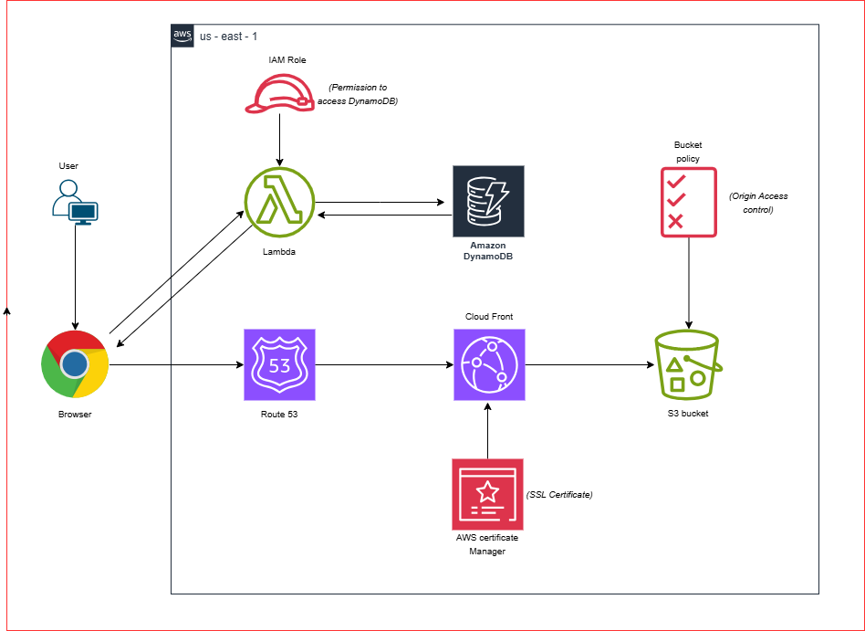

# Serverless Web Application using Lambda, Dynamo DB, S3 and CloudFront
## 📘 Project Overview
In this project we will build a serverless web application which will allow users to create, update, read and delete (CURD) items from a DynamoDB table. We will be utilizing a Lambda function URL for backend interaction without the need for an API Gateway. The app leverages various AWS services to ensure high availability, scalability, and secure content delivery, with a real-time view counter that tracks website visits.
## Architecture


The architecture consists of the following components:
1. Amazon S3: Stores static website files like HTML, CSS, and JavaScript.
2. Amazon CloudFront: Distributes website content globally, reducing latency.
3. Amazon Route 53: Manages the custom domain, routing traffic to the CloudFront distribution.
4. AWS Certificate Manager (ACM): Provides SSL/TLS certificates to secure the site over HTTPS.
5. AWS Lambda (with Function URL): A backend Lambda function URL that increments and retrieves the view count. Lambda executes serverless functions to handle backend logic for your website, such as managing CRUD operations and tracking viewer count.
   * For CRUD operations, Lambda functions can perform tasks like adding, reading, updating, or deleting data in DynamoDB
      when triggered.
   * You could set up a Lambda function that increments a viewer count in DynamoDB each time someone visits the site,
     creating a dynamic, real-time feature.
6. Amazon DynamoDB: Stores and manages data for the dynamic aspects of your website (e.g., viewer count, user data).,which
   will be accessible and updatable by Lambda.
   * Your Lambda functions can interact with DynamoDB to store and retrieve data as needed.
   * For the viewer count feature, DynamoDB can hold a record of the count, which Lambda updates each time a new visitor
     arrives. Additionally, DynamoDB can store other user-generated data if needed, making it ideal for any CRUD operations
     required for your application.

## End-to-End Flow with Lambda function URL as API Gateway
Here's how the view count will update each time someone visits the site:
1. When a user visits your website, the JavaScript function `updateViewCount()` will execute and make a `GET` request to the API Gateway endpoint.
2. API Gateway to Lambda: API Gateway receives the request and triggers the Lambda function.
3. Lambda Function Logic:
   * The Lambda function retrieves the current view count from DynamoDB.
   * It increments the count by 1.
   * It then updates the record in dynamoDB with the new count.
4. DynamoDB Updates: The updated view count is stored back in dynamoDB, making the new count available for next request.

## Step 1 - Setup S3 bucket
* Create a S3 bucket
* Upload your `index.html`, `styles.css` and `Javascript files`. Add `Lambda function URL` to the Javascript file after
  creating a lambda function which acts as a bridge between your website and the backend services (Lambda and dynamoDB) for
  tracking the view count.
* Setup a bucket policy to allow CloudFront to access the files. Cloudfront will create a bucket policy while creating a
  `origin access control`.
  
## Step 2 - Create a SSL cerificate for HTTPS access
* Go to Amazon certificate manager(ACM)->`Request a public certificate`->under Enter a fully qualified domain enter your 
  custom domain. You need to prove the ownership of the domain, so select `DNS validation`.
* The certificate must be in `US East(N. Virginia) Region (us-east-1)`.
* Go to Route 53, Once validated you can see a `CNAME record` that will be pointing to the certificate.
  
## Step 3 - Configure a CloudFront Distribution
* Create a cloudfront distribution with S3 bucket as origin.
* Create a `Origin access control` and add `origin type` as S3.
* Under `Default cache behavior` select `Viewer protocol policy` as `Redirect HTTP to HTTPS`.
* Under `Settings`, Add your custom domain name `Alternate domain name` and add the 'SSL certificate' created in ACM.
* After completing the creation of S3 bucket, CF will provide you with a S3 bucket policy to copy for `origin access control`.
  Go to S3 bucket->`Permissions`->`Bucket policy` and edit the bucket policy allow access to the S3 files from CF
  distribution. The sample of bucket policy is as follows:
```JSON
{
    "Version": "2008-10-17",
    "Id": "PolicyForCloudFrontPrivateContent",
    "Statement": [
        {
            "Sid": "AllowCloudFrontServicePrincipal",
            "Effect": "Allow",
            "Principal": {
                "Service": "cloudfront.amazonaws.com"
            },
            "Action": "s3:GetObject",
            "Resource": "arn:aws:s3:::serverlesswebapp-pranav/*",
            "Condition": {
                "StringEquals": {
                    "AWS:SourceArn": "arn:aws:cloudfront::963611518741:distribution/EBU82MIAR6SXR"
                }
            }
        }
    ]
}
```
## Step 4 - Implementing View Counter Using Lambda and DynamoDB
Create a dynamoDB table:
* Create a DynamoDB table. Enter `Partition key` as `id`. Leave rest of the things as default and create table.
* Click on the DynamoDB table->`Explore table items`->`create item`. Input the value of partition key(id) as `0`.
  Click on `Add new attribute` and select the type as `Number`. Give the Attribute name as `views` and enter the value as
  `1` and click on `create item`.

Create an IAM Role for Lambda to access dynamoDB table.
* Go to `IAM Console`-> `Roles`->`Create Role`->Select trusted identity type as `AWS Service`. Select the `Service or use 
  case` as `Lambda` and select `DynamoDBFullAccess` as the permissions policy. Give the Role a name. And Click on `Create
  Role`. 

Create a Lambda function:
* Go to `Lambda`-> `Create function`-> Select the `runtime`. Under the `advanced settings` click on `enable function URL`.
  Select the AUTH type as `NONE` which means the Lambda function URL will be publicly accessible.
  Enable `Configure cross-origin resource sharing(CORS)` so that only selected origins can access the lambda function. Then
  click on `Create function`.
* Go to `Permissions` in the Lambda tab. And attach the `IAM role` that you created. 
* Write a Lambda function using AWS SDK for python. The function is as follows:
```python
import json
import boto3
dynamodb = boto3.resource('dynamodb')
table = dynamodb.Table('serverlesswebapp-pranav')
def lambda_handler(event, context):
    response = table.get_item(Key={
        'id':'0'
    })
    views = response['Item']['views']
    views = views + 1
    
    print(views)
    
    response = table.put_item(Item={
        'id':'0',
        'views': views
    })
    
    return views
```

  In order to integrate the lambda function code changes to the website, we need to make certain changes to the `index.html` and javascript file so that view count will get updated. 
* Add the `Lamda function URL` to Javascript which lets website's backend to fetch the lambda function and update the view
  counter. This JavaScript code calls the `Lambda function URL` to fetch and update the view count whenever the page loads.

## Step 5 - Test and Deploy
* Update the S3 bucket with the newly updated website files.
* Make sure to invalidate the cloudfront cache. You can manually invalidate the CloudFront files, forcing the CF to fetch
  the latest version from your S3 bucket. Go to CF Distribution -> Invalidations -> Create invalidation -> In the `Add objec
  path` enter `/*`(This will invalidate all files, so cloudfront fetches the latest versions from S3).
* Optionally you can set a Lower Cache TTL. Set the `Minimum TTL`, `Maximum TTL`, and `Default TTL` to lower values (e.g.,
  0 for immediate refresh, though it may impact performance).

## ✅ Conclusion
This project showcases a fully serverless web application architecture , including a real-time view counter that integrates Lambda and DynamoDB without API Gateway. It’s a secure, scalable, and cost-effective solution for hosting static and dynamic content.


