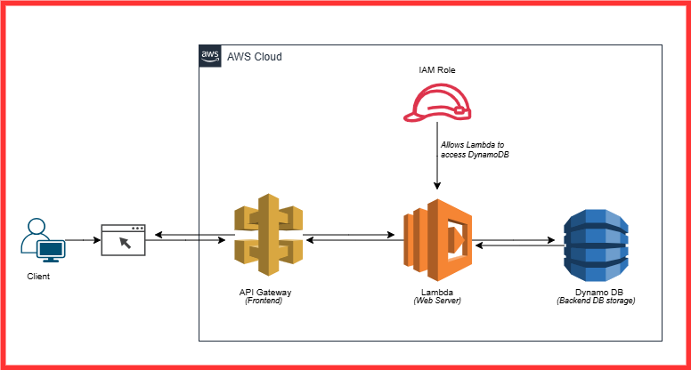

# Serverless Registration form
## Project Overview
The **serverless registration form** is serverless web application built using AWS services: API Gateway, Lambda, and DynamoDB. The main goal of this project is to provide a scalable and cost-effective solution for collecting user registration data without maintaining a traditional server.
## Project Architecture

## Step 1 - Create a dynamoDB table
* Go to DynamoDB console-> `Create table`-> Enter the table name as `registration-table` and Partition Key as `email`(String).
  (Primary key should be unique for each item in the table. In this table we will use `email` as the primary key since it is
  unique for each user). Then click on `Create table`.
## Step 2 - Create a IAM role for Lambda function
* We need to create an IAM Role with certain permissions that will allow Lambda function to access dynamoDB. Go to IAM console->
  Roles->Select trusted entity types as `AWS service`. Select the use case as `Lambda`.
* Assign `AmazonDynamoDBFullAccess` permission policy to the role.
* In order to look for the logs, we need to assign `CloudwatchFullAccess` permission policy as well. All the logs will be 
  written to CloudWatch.
* Give the role a name and Click on `Create Role`.
## Step 3 - Create a Lambda function
* In this step we will create a Lambda function that will handle form submission and store the data to dynamoDB table. We
  will use python as our Lambda function's programming language. 
* Go to Lambda console-> `Create function`-> Enter the function name as `registration-form-function`. Select the latest
  python runtime. Under 'Change default execution role' select `Use an existing role` and choose the IAM role that you
  created in the last step. Then click on `Create function`.
* Write a lambda function. Write the code for the Lambda function. We will define the Lambda function that recieves the 
  registration form data, creates a new item in the dynamoDB table and returns a response to the user. We will also add CORS 
  headers to the response to enable cross domain request from the frontend.
* In the `def Lambda_handler(event, context):` , here when user hits submit an 'event' is created. The 'event' will be in 
  JSON format. This information should be put into the dynamoDB table. using `response = table.put_item()` we are going to 
  put the information submitted by users to the dynamoDB table. And the infos collected using the variables like `email`, 
  `name`,`phone`,`password`. For this to work we need to create entries in the dynamoDB table.
* Once you've written the lambda code hit 'deploy'.
## Step 4 - Add the items to DynamoDB
* Go to dynamoDB-> the table that you've created-> Explore table items -> Create item->Click on `Add new attribute`->`string`
  and enter `name`. Similarly add `phone`, `password`.
## Step 5 - Create API Gateway and enable CORS
* In this step we will create an API gateway and will trigger a Lambda function whenever a form is submitted. We will also 
  enable CORS for our endpoint to allow cross domain request from our frontend. We will define a `POST` method for our API 
  gateway and configure to trigger our Lambda function.
* Go to API gateway console-> Select `REST API`-> Click on build-> Click on 'create API' and enter the name of the API 
  gateway. Select the endpoint type as `regional`.
* We need to create 'resource' and 'methods' for this API. Click on `Actions` and `Create resource` and enter the 
  `resource_path`. (The resource path should match the 'API URL path' in the frontend code)
* Click on `Enable API Gateway CORS` and click on `Create resource`.
* Now we need to create a 'method'. The method will be `POST`. After select the method as POST we need to select the 
  `Integration type` as `Lambda function`. Under `Lambda function` enter the name of the lambda function that you have 
  created. Then click on `Save`.
* We need to Enable CORS. Make sure you have `OPTIONS` and `POST` selected under 'Methods'. Click on `Enable CORS and 
  replace existing CORS headers`.
* At last Click on `Deploy API`. Enter the 'Deployment stage' as `[New Stage]`, 'Stage name' as `prod`.Click on `Deploy`.
  Once deployed you need to copy the `Invoke URL` and paste it in the `Frontend`(i.e..Javascript code).
* ## 🔍 Testing
  You can verify the data directly in the DynamoDB console by viewing the items in the `registration-table` table.
## 📚 Conclusion
  This project demonstrates how to build a serverless registration form using AWS services, providing a scalable and 
  efficient way to handle user registrations. With API Gateway, Lambda, and DynamoDB, we have a fully managed solution that 
  reduces the complexity of handling backend operations.
