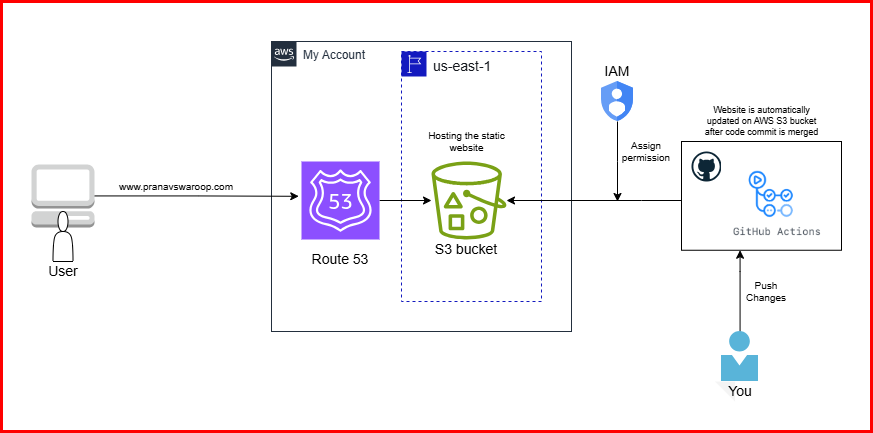

# Static Website Hosting on AWS S3 with CI/CD using GitHub Actions
## Introduction
#### This project demonstrates how to host a static website on AWS S3, using a custom domain registered in AWS Route 53. The website files are managed in a GitHub repository, and GitHub Actions are configured to provide CI/CD, syncing changes to S3 automatically when updates are made to the code.
## Project Architecture

## Stage 1 - Create the S3 Bucket
#### Create a S3 bucket to store the static website files. The name of the S3 bucket should be same as the custom domain name.
* disable `block all public access` inorder to allow public internet to access the bucket.
* select `ACLs enabled` option. Since the website files will be owned by github repository and not by S3, we need to enable ACL(Access control list) inorder to allow github repository to access the S3 bucket and its objects. Create the bucket after configuring these settings.
* Go to 'properties' in the S3 tab and enable `Static website hosting`. Specify the name of the html file as index.html
## Stage 2 - Setting up a Github repository
* create github repository to store the website files. Upload the files in a specific folder called `Website`
* create a github workflow directory and add a `workflow file` to run a job which deploys the website files to S3 bucket. It also triggers the workflow file whenever there's change in code. This how CI/CD in github action works.
The workflow file is a Yaml file which uses `'S3-sync-action'`. This action is readily available on github marketplace.
The code requires parameters like `**AWS_S3_BUCKET**` which will be the name of the S3 bucket where the website files are going to get deployed. `**AWS_ACCESS_KEY_ID**` & `**AWS_SECRET_ACCESS_KEY**` parameters are basically provided by IAM inorder for the github to access S3 bucket.

IAM:
   * Create an `**'IAM user'**` for github action and attach a `**'AmazonS3FullAccess'**` permissions policy. Github will use this `IAM user` to authenticate to AWS account.
   * Under 'Security credentials' create an Access key and Secret access key.
* Once we have all three parameters, add these to `Repository secrets` of 'Actions' under 'Secrets and variables'.
Pass the bucket name to `**AWS_S3_BUCKET**` variable, access key ID to `**AWS_ACCESS_KEY_ID**` variable and Secret access 
key to `**AWS_SECRET_ACCESS_KEY**` variable.
* In the YAML code template, specify `AWS_REGION` as `us-east-1` which is the region where the S3 bucket is located.
Under `SOURCE_DIR` Specify the 'repository' where website files are stored.

The CI/CD `Workflow file` written in `YAML template` for github actions to automate the deployment process is as follows:
```yaml
# GitHub Actions CI/CD workflow file for S3 deployment
name: Upload Website

on:
  push:
    branches:
    - main

jobs:
  deploy:
    runs-on: ubuntu-latest
    steps:
    - uses: actions/checkout@master
    - uses: jakejarvis/s3-sync-action@master
      with:
        args: --acl public-read --follow-symlinks --delete
      env:
        AWS_S3_BUCKET: ${{ secrets.AWS_S3_BUCKET }}
        AWS_ACCESS_KEY_ID: ${{ secrets.AWS_ACCESS_KEY_ID }}
        AWS_SECRET_ACCESS_KEY: ${{ secrets.AWS_SECRET_ACCESS_KEY }}
        AWS_REGION: 'us-east-1'   # optional: defaults to us-east-1
        SOURCE_DIR: 'Static-Website-S3-Route53/Website'      # optional: defaults to entire repository
```

Add a S3 bucket policy:
  * Add a S3 bucket policy to allow github to access S3 bucket. Go to `awspolicygen.amazonaws.com` to create a bucket policy. 'Principle' of the policy will be the ARN of the `IAM User` that was created for github. Allow `All Actions`. `ARN` will be the ARN of the S3 bucket.  Once the policy is generated paste it under S3's `bucket policy` under 'Permissions'.

The bucket policy, written in JSON, provides access to the objects stored in the bucket. 
```JSON
{
    "Version": "2012-10-17",
    "Id": "Policy1729991484655",
    "Statement": [
        {
            "Sid": "Stmt1729991468347",
            "Effect": "Allow",
            "Principal": {
                "AWS": "arn:aws:iam::963611518741:user/githubaction-S3sync"
            },
            "Action": "s3:*",
            "Resource": "arn:aws:s3:::cloud.pranavswaroop.click"
        }
    ]
}
```
* Now that we have configured all the permission for the github to access S3 bucket, go to the repository and push some changes to the code. Once we `commit changes` this will automatically trigger the 'Workflow file'. Once all the steps run successfully , the changes/ website files will be deployed to the S3 bucket. We can check this by refreshing the `objects` section of S3. To view the website, click on the `bucket website endpoint` in properties section.
## Stage 3 - Add a custom domain using Route 53
*I have registered a custom domain in Route 53. Route 53 will allocate a `Hosted zone` for the domain. 
* Create a record for the custom domain. The name of the record should be same as the name of the bucket.
Add an `A record` to direct traffic from your domain to the IP adress.  The A record(ALIAS) allows Route 53 to map the domain to the S3 bucket URL (e.g., example-bucket.s3-website-region.amazonaws.com). This ensures that requests to custom domain are directed to the website hosted in S3.
* Set the 'Routing policy' as `simple routing`, which is used to direct traffic to a single resource i.e S3 bucket. With Simple Routing, we can create a DNS record that routes traffic to just one IP address or endpoint. `Save` record.

## 🎉 Conclusion
Now, all the configurations has been completed. Once we enter the custom domain to the browser the website will be displayed. The GitHub Actions workflow file automates deployment by syncing the S3 bucket with any new changes pushed to the main branch.
