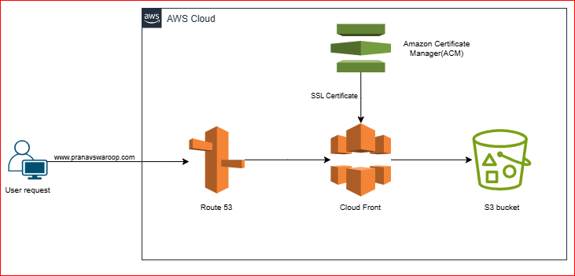

# Static Website with Amazon S3, CloudFront, ACM SSL, and Route 53
## 📘 Introduction
In this project we are going to host a static website using amazon S3. S3 serves as the origin for the website's static files. 
Amazon CloudFront is used for CDN (Content Delivery Network) to enhance website performance by reducing latency and ensure secure HTTPS delivery.AWS Certificate Manager (ACM) issues an SSL certificate for HTTPS access. Route 53 manages the custom domain.
## Architecture

* When an user tries to access a domain(ex:www.pranavswaroop.com), the domain hosted on route53 which has an `Alias record` configured points the request to cloudFront. 
* CloudFront first checks if the requested content is available in its `cache` at an `edge location` near the user. If the content is cached, CF serves the files immediately, reducing latency and improving load times.
* Cloudfront uses SSL certificate issued by `AWS certificate manager(ACM)` to establish a secure HTTP connection ensuring that the data b/w the user and CF is encrypted.
* If the requested file isn't in the CF cache, CF forwards the request to `origin(S3 bucket)` where the website's static files are stored. S3 serves the file back to CloudFront. This initial fetch happens only if CloudFront’s cache doesn’t already contain the requested content.
* Once the file is fetched from S3, CloudFront caches it at the edge location that handled the request. This cached content will serve future requests from users in the same or nearby locations without needing to retrieve it from S3 again, optimizing performance.
* The requested file will be sent from CF to user's browser over HTTPS.
## Stage 1 - Register a domain in Route 53
* Go to `AWS Console`->`Route 53`->`Register domain`. Type the domain that you want, it has to be unique. Check the availability and buy the domain. AWS will automatically create hosted zones for you for the domain that you bought. It will create two records for the doamin, NS(Name server) record and SOA(Start of Authority) record.
## Stage 2 - Create a S3 bucket 
* Go to S3 console and create a bucket. The bucket name does *not* need to match custom domain name since you're using CF as a CDN infront of your S3 bucket.
* You can 'Tag your resources'. This tags will be used to filter in your `Cost and Usage report` for `Access control` and other settings. Then Click on `Create bucket`.
* Upload the HTML and CSS files to the bucket.
* Go to `Properties`->`Static Website hosting`->Then 'Enable' static website hosting. Specify the name of the index file and the error document.  click on `Save Changes`.
* Go to `Permissions`->`Bucket policy` and edit the bucket policy for the public internet to access the S3 bucket. ARN to be mentioned in the bucket policy will be the ARN of the S3 bucket. The sample of bucket policy is as follows:
```JSON
{
  "Version": "2012-10-17",
  "Statement": [
    {
      "Effect": "Allow",
      "Principal": {
        "Service": "cloudfront.amazonaws.com"
      },
      "Action": "s3:GetObject",
      "Resource": "arn:aws:s3:::your-bucket-name/*",
      "Condition": {
        "StringEquals": {
          "AWS:SourceArn": "arn:aws:cloudfront::account-id:distribution/distribution-id"
        }
      }
    }
  ]
}
```
## Stage 3 - Create a SSL cerificate for HTTPS access
* Go to Amazon certificate manager(ACM)->`Request a public certificate`->under `Enter a fully qualified domain` enter your domain registered in Route 53. You need to prove the ownership of the domain, so select `DNS validation`.
* Go to Route 53, Once validated, you can see a `CNAME record` that will be pointing to the certificate.

## Stage 4 - Create a cloudFront distribution
* Go to CloudFront->`Distributions->`Click on `Create Distribution`. If you click `Origin domain` it will give you an option to select S3 bucket, but we do't want the CF to access S3 bucket directly we want it access the S3 endpoint. So under `Properties`->`Static Website hosting` of S3 bucket, You'll get to see `bucket website endpoint`. If the enddpoint is 
`http://pranavswaroop.click.s3-website-us-east-1.amazonaws.com` copy everything after `//` and paste it under `Origin domain` of the CF distribution. 
* Under, `Default cache behavior`->`Viewer protocol policy` select `Redirect HTTP to HTTPS`.
* Under, `Settings`-> Add `Alternate domain name(CNAME)`. The CNAME will be your domain registered with Route 53. Choose the 
`SSL certificate` that you created for the domain.
* Evrything else can be left as default and click on `Create distribution`. This can take upto a few minutes.
  
## Stage 5 - Map the route 53 domain to cloud front distribution
* Go to `R53`->`Create record`->`Simple record`->Under 'define simple record', select 'A record' and Choose `Alias` to CloudFront distribution and select your CF distribution that you created. Then click `Define simple record` and create the record.

Now if you go to your browser and enter your domain name, you can verify your website which is accessible over HTTPS. 

## ✅ Conclusion
In this way, you can use CloudFront to deliver your web content through its edge locations. CF uses S3 bucket as origin to server the static contents. SSL certificate added to the domain name helps in redirecting the HTTP request to HTTPS. 
 
